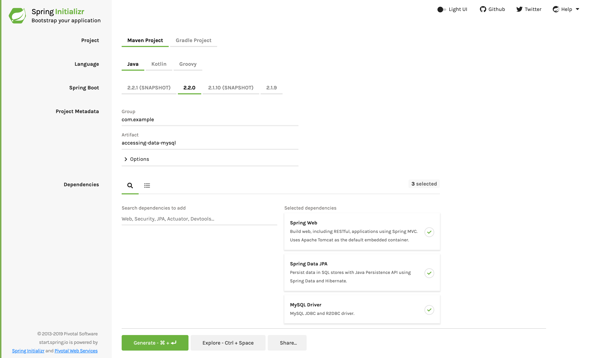

:spring_version: current
:spring_boot_version: 2.1.6.RELEASE
:Controller: http://docs.spring.io/spring/docs/{spring_version}/javadoc-api/org/springframework/stereotype/Controller.html
:SpringApplication: http://docs.spring.io/spring-boot/docs/{spring_boot_version}/api/org/springframework/boot/SpringApplication.html
:toc:
:icons: font
:source-highlighter: prettify
:project_id: gs-accessing-data-mysql

This guide walks you through the process of creating a Spring application connected to a
MySQL Database (as opposed to an in-memory, embedded database, which most of the other
guides and many sample applications use). It uses Spring Data JPA to access the database,
but this is only one of many possible choices (for example, you could use plain Spring
JDBC).

== What You Will Build

You will create a MySQL database, build a Spring application, and connect it to the newly
created database.

NOTE: MySQL is licensed with the GPL, so any program binary that you distribute with it
must use the GPL, too. See the
https://www.gnu.org/licenses/gpl.html[GNU General Public Licence].

== What You Need

* https://dev.mysql.com/downloads/[MySQL] version 5.6 or better. If you have Docker
installed, it might be useful to run the database as a
https://hub.docker.com/_/mysql/[container].

:java_version: 1.8
include::https://raw.githubusercontent.com/spring-guides/getting-started-macros/master/prereq_editor_jdk_buildtools.adoc[]

include::https://raw.githubusercontent.com/spring-guides/getting-started-macros/master/how_to_complete_this_guide.adoc[]

[[scratch]]
== Starting with Spring Initializr

For all Spring applications, you should start with the https://start.spring.io[Spring
Initializr]. The Initializr offers a fast way to pull in all the dependencies you need for
an application and does a lot of the set up for you. This example needs the Spring Web
Starter, Spring Data JPA, and MySQL Driver dependencies. The following image shows the
Initializr set up for this sample project:

NOTE: The preceding image shows the Initializr with Maven chosen as the build tool. You
can also use Gradle. It also shows values of `com.example` and `accessing-data-mongodb` as
the Group and Artifact, respectively. You will use those values throughout the rest of
this sample.

The following listing shows the `pom.xml` file created when you choose Maven:

====
[src,xml]
----
include::complete/pom.xml[]
----
====

The following listing shows the `build.gradle` file created when you choose Gradle:

====
[src,groovy]
----
include::complete/build.gradle[]
----
====

[[initial]]
== Create the Database

Open a terminal (command prompt in Microsoft Windows) and open a MySQL client as a user
who can create new users.

For example, on a Linux system, use the following command;

====
[source, sh]
----
$ sudo mysql --password
----
====

NOTE: This connects to MySQL as `root` and allows access to the user from all hosts. This
is *not the recommended way* for a production server.

To create a new database, run the following commands at the `mysql` prompt:

====
[source, mysql]
----
mysql> create database db_example; -- Creates the new database
mysql> create user 'springuser'@'%' identified by 'ThePassword'; -- Creates the user
mysql> grant all on db_example.* to 'springuser'@'%'; -- Gives all privileges to the new user on the newly created database
----
====

== Create the `application.properties` File

Spring Boot gives you defaults on all things. For example, the default database is `H2`.
Consequently, when you want to use any other database, you must define the connection
attributes in the `application.properties` file.

Create a resource file called `src/main/resources/application.properties`, as the
following listing shows:

====
[source, java]
----
include::complete/src/main/resources/application.properties[]
----
====

Here, `spring.jpa.hibernate.ddl-auto` can be `none`, `update`, `create`, or `create-drop`.
See the Hibernate documentation for details.

* `none`: The default for `MySQL`. No change is made to the database structure.
* `update`: Hibernate changes the database according to the given entity structures.
* `create`: Creates the database every time but does not drop it on close.
* `create-drop`: Creates the database and drops it when `SessionFactory` closes.

You must begin with either `create` or `update`, because you do not yet have the database
structure. After the first run, you can switch it to `update` or `none`, according to
program requirements. Use `update` when you want to make some change to the database
structure.

The default for `H2` and other embedded databases is `create-drop`. For other databases,
such as `MySQL`, the default is `none`.

NOTE: It is good security practice to, after your database is in production state, set
this to `none`, revoke all privileges from the MySQL user connected to the Spring
application, and give the MySQL user only `SELECT`, `UPDATE`, `INSERT`, and `DELETE`. You
can read more about this at the end of this guide.

== Create the `@Entity` Model

You need to create the entity model, as the following listing
(in `src/main/java/hello/User.java`) shows:

====
[source,java]
----
include::complete/src/main/java/com/example/accessingdatamysql/User.java[]
----
====

Hibernate automatically translates the entity into a table.

== Create the Repository

You need to create the repository that holds user records, as the following listing
(in `src/main/java/com/example/accessingdatamysql/UserRepository.java`) shows:

====
[source,java]
----
include::complete/src/main/java/com/example/accessingdatamysql/UserRepository.java[]
----
====

Spring automatically implements this repository interface in a bean that has the same name
(with a change in the case -- it is called `userRepository`).

== Create a Controller

You need to create a controller to handle HTTP requests to your application, as the
following listing (in `src/main/java/hello/MainController.java`) shows:

====
[source,java]
----
include::complete/src/main/java/com/example/accessingdatamysql/MainController.java[]
----
====

NOTE: The preceding example explicitly specifies `POST` and `GET` for the two endpoints.
By default, `@RequestMapping` maps all HTTP operations.

== Create an Application Class

Spring Initializr creates a simple class for the application. The following listing shows
the class that Initializr created for this example (in
`src/main/java/com/example/accessingdatamysql/AccessingDataMysqlApplication.java`):

====
[source,java]
----
include::initial/src/main/java/com/example/accessingdatamysql/AccessingDataMysqlApplication.java[]
----
====

For this example, you need not modify the `AccessingDataMysqlApplication` class.

include::https://raw.githubusercontent.com/spring-guides/getting-started-macros/master/spring-boot-application-new-path.adoc[]

include::https://raw.githubusercontent.com/spring-guides/getting-started-macros/master/build_an_executable_jar_subhead.adoc[]

include::https://raw.githubusercontent.com/spring-guides/getting-started-macros/master/build_an_executable_jar_with_both.adoc[]

When you run the application, logging output is displayed. The service should be up and running within a few seconds.

== Test the Application

Now that the application is running, you can test it by using `curl` or some similar tool.
You have two HTTP endpoints that you can test:

`GET localhost:8080/demo/all`: Gets all data.
`POST localhost:8080/demo/add`: Adds one user to the data.

The following curl command adds a user:

====
[source,sh]
----
$ curl localhost:8080/demo/add -d name=First -d email=someemail@someemailprovider.com
----
====

The reply should be as follows:

====
[source,sh]
----
Saved
----
====

The following command shows all the users:

====
[source,sh]
----
$ curl 'localhost:8080/demo/all'
----
====

The reply should be as follows:

====
[source,json]
----
[{"id":1,"name":"First","email":"someemail@someemailprovider.com"}]
----
====

== Make Some Security Changes

When you are on a production environment, you may be exposed to SQL injection attacks. A
hacker may inject `DROP TABLE` or any other destructive SQL commands. So, as a security
practice, you should make some changes to your database before you expose the application
to your users.

The following command revokes all the privileges from the user associated with the Spring
application:

====
[source,sh]
----
mysql> revoke all on db_example.* from 'springuser'@'localhost';
----
====

Now the Spring application cannot do anything in the database.

The application must have some privileges, so use the following command to grant the
minimum privileges the application needs:

====
[source,sh]
----
mysql> grant select, insert, delete, update on db_example.* to 'springuser'@'localhost';
----
====

Removing all privileges and granting some privileges gives your Spring application the
privileges necessary to make changes to only the data of the database and not the
structure (schema).

When you want to make changes to the database:

. Regrant permissions.
. Change the `spring.jpa.hibernate.ddl-auto` to `update`.
. Re-run your applications.

Then repeat the two commands shown here to make your application safe for production use
again. Better still, use a dedicated migration tool, such as Flyway or Liquibase.

== Summary

Congratulations! You have just developed a Spring application that is bound to a MySQL
database and is ready for production!

== See Also

The following guides may also be helpful:

* https://spring.io/guides/gs/accessing-data-jpa/[Accessing Data with JPA]
* https://spring.io/guides/gs/accessing-data-mongodb/[Accessing Data with MongoDB]
* https://spring.io/guides/gs/accessing-data-gemfire/[Accessing data with Gemfire]

include::https://raw.githubusercontent.com/spring-guides/getting-started-macros/master/footer.adoc[]
